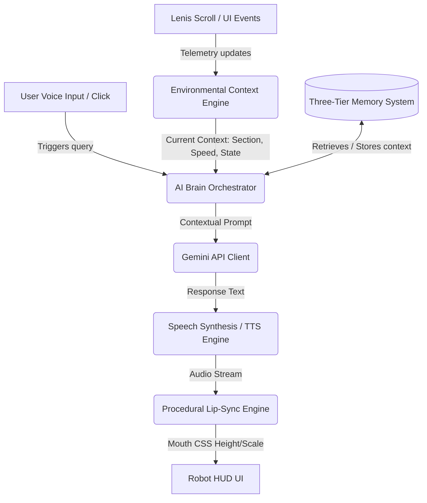
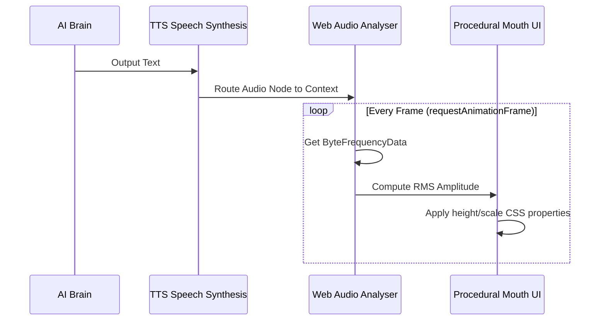

# Translink AI Companion Architecture: Gemini-Powered Voice Friend
## Complete Engineering Implementation Plan

This plan documents the architecture, data flows, and integration details to transform `TranslinkEasterEggFriend` into an advanced, context-aware, voice-enabled interactive assistant. The system leverages the Google Gemini API, a three-tier persistent client memory system, real-time scroll/navigation telemetry, and a procedural lip-sync engine.

---

## 1. Architectural Overview & Data Flow

The AI Companion operates as an autonomous, context-aware agent overlaying the Translink HUD layer. It coordinates telemetry data (scrolling, active section, UI events), memory retrieval, dynamic LLM generation, and speech synthesis.



---

## 2. Dynamic Language Alignment Rules

In strict compliance with the dynamic language activation system defined in [language_config.json](file:///c:/Users/Abebaw/Desktop/TRANSLINK_CMS/TRANSLINK_WEB/src/translinkconfig/language_config.json):
* **Language Pruning**: The assistant's conversation engine will only operate in languages that are active at runtime (where value is `1`).
* **Active Mapping**:
  * `EN` (English): maps to `en-US` for Speech-to-Text (STT) and Text-to-Speech (TTS).
  * `AM` (Amharic): maps to `am-ET` for Speech-to-Text (STT) and Text-to-Speech (TTS).
  * `AR` (Arabic): maps to `ar-SA` for Speech-to-Text (STT) and Text-to-Speech (TTS).
* **System Prompts**: The Gemini API system prompts are dynamically localized based on the active language. If a language is disabled (e.g. `AR` set to `0`), the assistant will completely refuse to communicate, translate, or synthesize voice in that language.

---

## 3. The Three-Tier Memory System

To deliver an engaging, personalized relationship, the assistant employs three storage layers:

| Memory Layer | Storage Mechanism | Data Lifespan | Typical Stored Structures |
| :--- | :--- | :--- | :--- |
| **Short-Term Memory** | `sessionStorage` / In-Memory Array | Active Tab Session | Recent conversation history (last 5 turns), current scroll speeds, and session-specific triggers. |
| **Long-Term Memory** | `localStorage` | Indefinite (Persistent) | User name, Relationship level (0–100), customized robot color preferences, and completed interactive waypoints. |
| **Semantic Knowledge** | Structured JSON Map | Static / Boot-loaded | Site hierarchy, product details (GPS tracking, fuel management), and custom brand facts. |

### Memory Schemas

#### Long-Term Memory (Stored under `translink_friend_long`)
```json
{
  "userName": "Abebaw",
  "relationshipLevel": 85,
  "themeColor": "#c8ff2e",
  "discoveredWaypoints": ["fuel-head", "precision-tracking"],
  "interactionCount": 42
}
```

#### Short-Term Memory Buffer
```typescript
interface ChatMessage {
  role: 'user' | 'model';
  text: string;
  timestamp: number;
}
```

---

## 4. Environmental & Scroll Context Engine

The assistant is "physically" aware of the user's location and reading speed inside the 10-section layout.

### A. Scroll Speed Tracking
By binding to the unified Lenis scroll instance in [TranslinkScrollSystem.ts](file:///c:/Users/Abebaw/Desktop/TRANSLINK_CMS/TRANSLINK_WEB/src/translink/controllers/TranslinkScrollSystem.ts), the engine computes absolute scroll velocity:
```typescript
import { scrollSystem } from '../controllers/TranslinkScrollSystem';

let lastScrollY = 0;
let scrollVelocity = 0;

scrollSystem.getLenis()?.on('scroll', (e: any) => {
    scrollVelocity = Math.abs(e.velocity); // Pixels per frame
});
```

### B. Proactive Triggers
If the user scrolls extremely fast through a technical section, the companion will comment in a playful, friendly way:
* **High Velocity Warning**: *"Whoa, slow down! You're zooming past our high-accuracy Fuel Management system! ⛽"*
* **Deep Reading Praise**: If the user stays in a section (e.g. S4 Analytics) for > 15 seconds without moving: *"Fascinating, isn't it? Our CAN-bus diagnostics capture deep real-time telematics."*

---

## 5. AI Brain: Gemini API Orchestration

The brain structures a localized context payload and sends it to the Gemini API using `gemini-2.5-flash` or `gemini-2.5-pro` via a secure application proxy or client SDK configuration.

### Dynamic Prompt Structure
```typescript
const systemInstruction = `
You are the Translink AI Companion, a brilliant, helpful, and highly energetic micro-robot that lives on the Translink Fleet Telematics website.
Your character traits:
- Professional, technical, but extremely enthusiastic about IoT, vehicle diagnostics, fuel sensors, and AI telematics.
- Playful and conversational. You speak in short, punchy paragraphs (maximum 2-3 sentences) perfect for floating bubble notifications.
- Languages: You only speak in the following active languages: ${enabledLanguages.join(', ')}. Currently, the selected language is: ${currentLanguage}.
- Respect the active user state: The user is currently reading Section "${currentSection}" and has been moving at speed "${scrollVelocityLabel}".
`;
```

---

## 6. Procedural Speech & Real-Time Lip-Sync

To create premium, believable lifelike feedback, the voice synthesis (TTS) drives the mechanical movement of the companion's mouth dynamically using Web Audio API frequency analysis.



### Lip-Sync Implementation Details
1. **Audio Routing**: Use a custom `AudioContext` and connect `SpeechSynthesisUtterance` or an external MP3 stream to a `MediaStreamAudioDestinationNode` and an `AnalyserNode`.
2. **Procedural Visemes**: Instead of complex phonetic maps, compute the root-mean-square (RMS) volume amplitude in a `requestAnimationFrame` loop.
3. **Mouth Animation**:
   ```typescript
   function updateMouthAnimation() {
       const array = new Uint8Array(analyser.frequencyBinCount);
       analyser.getByteFrequencyData(array);
       let sum = 0;
       for (let i = 0; i < array.length; i++) sum += array[i];
       const average = sum / array.length;
       
       // Map amplitude to vertical height scale of .robot-mouth
       const mouthScale = 0.2 + (average / 128) * 1.5;
       if (mouthEl) {
           mouthEl.style.transform = `scaleY(${mouthScale})`;
       }
       
       if (isPlaying) requestAnimationFrame(updateMouthAnimation);
   }
   ```

---

## 7. Roadmap to Implementation

```
[Phase 1: Config & Hooks] ──► [Phase 2: Speech & Analyser] ──► [Phase 3: LLM Integration]
       (Complete)                 (Web Speech + CSS)            (Gemini Proxy API)
```

1. **Phase 1: Language Controls (Completed)**: Ensure the UI, toggles, and controller respect `language_config.json` manually enabled/disabled states.
2. **Phase 2: Voice & Lip-Sync (Next)**: Implement Web Audio Analyser and tie speech synthesis directly to the `.robot-mouth` element's procedural SVG scaling.
3. **Phase 3: Prompt Orchestrator & Gemini SDK (Final)**: Setup client-side secure proxy and persistent memory schemas to complete the loop.
