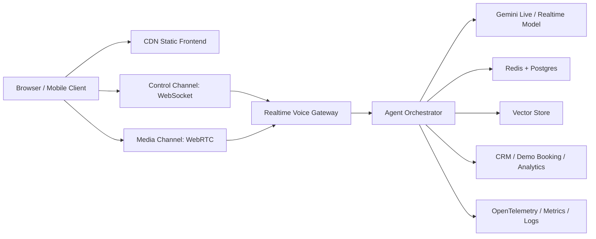

# Translink Production Voice Agent Architecture Plan

## Non-Negotiable Loading Contract

The Robot and Voice agent must initialize only after the full 3D experience is loaded and stable:

- 3D world initialized
- GLB models loaded
- HDR/environment textures loaded
- material and animation systems initialized
- section DOM mounted
- GSAP/ScrollTrigger and SceneBridge refreshed
- loader hide transition completed

The voice engine, microphone permission request, WebSocket/WebRTC connection, and AI session must not start during the initial 3D loading phase. Voice startup is allowed only after the post-load Robot layer is mounted and the visitor explicitly taps the Robot/body/logo, except for future production-approved proactive flows that run after the same readiness gate.

## Current System Summary

The current implementation is a working Gemini Live WebSocket voice prototype integrated into a rich 3D Translink website. The browser captures microphone PCM with Web Audio, streams it through `/ws/live`, the Node service relays it to Gemini Live, and audio chunks are played back in the browser while the Robot animates through listening and speaking states.

Core files:

- Frontend voice client: `src/translink/components/TranslinkVoiceManager.ts`
- Robot interaction layer: `src/translink/components/TranslinkEasterEggFriend.ts`
- Client behavioral brain: `src/translink/components/TranslinkAIBrain.ts`
- App bootstrap: `src/translink/main.ts`
- Backend realtime service: `server/services/GeminiLiveService.ts`
- WebSocket server: `server/index.ts`
- Server memory/RAG: `server/brain`
- Voice configuration: `src/translinkconfig/live-voice`

## Production Gaps

1. Secrets must not live in source or distributable `.env` files.
2. `/ws/live` needs origin validation, rate limits, max session age, message limits, heartbeat, and structured close behavior.
3. Config and knowledge files are read synchronously on live connection paths.
4. Session logs are written with blocking filesystem calls.
5. Voice transport is WebSocket JSON/base64, which is workable but not ideal for low-latency mobile production voice.
6. No production observability exists for tap-to-mic, session-ready, first-audio-byte, playback-start, interruption latency, and disconnect causes.
7. RAG is placeholder keyword matching, not durable vector retrieval.
8. Client localStorage memory is useful for UX but is not enterprise memory.
9. AI orchestration is split between frontend behavioral prompts and backend system instructions.
10. Heavy 3D/frontend assets dominate startup and must remain separate from the voice lifecycle per the loading contract.

## Target Production Architecture

## Implementation Roadmap

### Phase 1: Stabilize Current WebSocket Voice

- Keep Robot and voice initialization behind the post-3D readiness gate.
- Lazy-create the voice manager only after Robot mount and user interaction.
- Cache voice config and knowledge at process startup.
- Remove blocking filesystem I/O from live connection and message paths.
- Add heartbeat and max session lifetime for WebSocket sessions.
- Validate WebSocket origins in production.
- Add message size limits and defensive JSON parsing.
- Add structured session lifecycle logs.

### Phase 2: Low-Latency Conversation Quality

- Add client VAD to avoid sending silence continuously.
- Add barge-in handling: stop local playback immediately when user speech resumes during AI output.
- Track audio chunk queue depth and reduce playback lookahead dynamically.
- Add reconnect and degraded-network states.
- Add explicit mic permission UX states.
- Add session-ready, listening, speaking, interrupted, reconnecting, and failed states.

### Phase 3: Server-Side Agent Orchestration

- Introduce `AgentOrchestrator` to own turn state, prompt policy, memory budget, tool calls, and safety rules.
- Move production prompt decisions from frontend into backend orchestration.
- Keep frontend as an event source: section changed, user clicked, user lingered, user requested help.
- Add context budget:
  - current page section
  - active user intent
  - short rolling transcript summary
  - top knowledge snippets
  - lead/demo workflow state

### Phase 4: Real Memory and Retrieval

Current status: Phase 4 foundation is implemented, not the full enterprise memory infrastructure.

The current system uses real local retrieval and clean modular interfaces while staying local-first:

- `AgentOrchestrator` owns session prompt assembly, language policy, memory insertion, and retrieval context injection.
- `RagService` builds a local chunk index from `src/translinkconfig/live-voice` knowledge files and retrieves relevant snippets at turn time.
- `MemoryService` keeps bounded short-term session memory in process and writes async JSONL session logs for local audit/debugging.
- Storage adapter contracts define the future boundary for durable memory, vector stores, and active session stores.

Enterprise target state:

- Move company knowledge retrieval to Postgres + pgvector or Qdrant.
- Move active sessions and short-term context to Redis or another low-latency shared session store.
- Move consented long-term lead/session records to PostgreSQL durable memory.
- Add retention policy, deletion workflows, visitor consent controls, and memory export/audit capabilities.
- Keep the local-first implementation as the development fallback and migration bridge.

Priority note: durable Redis/Postgres/pgvector/Qdrant storage adapters are intentionally deferred until the higher-priority production testing, diagnostics, readiness, frontend performance, WebSocket stability, and WebRTC planning tasks are complete. The adapter contracts remain in place so the migration is straightforward when durable storage becomes the bottleneck.

### Phase 5: WebRTC Production Transport

Current status: WebRTC production transport foundation is implemented; full WebRTC media relay is still a future deployment task.

- Added a rate-limited `/api/rtc/session` endpoint for ephemeral WebRTC session metadata.
- The endpoint returns ICE server metadata, session expiry, provider status, and the WebSocket control-channel path.
- WebSocket remains the active production voice media/control transport until `VOICE_RTC_ENABLED=true` and a media provider/TURN deployment is configured.
- TURN configuration is environment-driven through `RTC_TURN_URLS`, `RTC_TURN_USERNAME`, and `RTC_TURN_CREDENTIAL`.
- Future work: connect the browser audio media path to a selected WebRTC provider or self-hosted media gateway such as LiveKit, Cloudflare Calls, Daily, Twilio Live, mediasoup, or Janus.

### Phase 6: Frontend Performance

- Keep the current 3D-first loading contract.
- Lazy-load the Robot/Voice agent module only after the loader hide transition completes.
- Cache 3D models, HDR, audio, JS, and CSS with immutable headers.
- Use mobile LOD models and texture compression.
- Reduce repeated section CSS.
- Keep voice/Robot code out of the critical 3D loading path until post-load mount.
- Add production bundle analysis and performance budgets.

Current status: Robot/Voice lazy-loading and production immutable asset cache headers are implemented without restructuring `src/translinkscene` and without modifying existing `.glb` files. Deeper 3D asset optimization remains limited to server/build delivery, caching, compression, CDN policy, and future optional generated derivatives outside the protected scene/model source.

### Phase 7: Observability

Track per session:

- page load start
- 3D assets loaded
- loader hidden
- Robot mounted
- user tap time
- mic permission prompt time
- mic active time
- WebSocket/WebRTC connected time
- Gemini setup complete time
- first model audio byte time
- first playback start time
- interruption latency
- disconnect reason
- model error rate
- cost/session estimate

Current status: voice telemetry records server lifecycle timings, client metrics, setup time, first audio, first playback timing, mic permission timing, socket close/error signals, interruption counters, playback interruption counters, and memory/retrieval/orchestrator/RTC readiness snapshots.

### Phase 8: Production Testability and Release Readiness

- Add a protected voice readiness endpoint that validates environment, config files, local retrieval, memory, telemetry, and critical frontend/backend integration contracts.
- Add a CLI readiness script for fast local and CI smoke checks.
- Keep durable storage adapter implementation deferred unless readiness checks show local memory/retrieval is blocking testing or scale validation.
- Add browser smoke tests for the 3D loading gate, Robot tap interaction, mic permission path, WebSocket connection, VAD/barge-in events, and telemetry events.
- Add deployment smoke checks for `/api/health`, `/api/voice/readiness`, `/api/voice/telemetry`, `/api/voice/memory`, and `/ws/live` upgrade behavior.

## Deployment Strategy

- Static frontend: Cloudflare Pages, S3 + CloudFront, Firebase Hosting, Vercel, or Netlify.
- Realtime gateway: Cloud Run with min instances, Fly.io, ECS/Fargate, or Kubernetes.
- Session store: Redis.
- Durable memory: Postgres.
- Vector retrieval: pgvector or Qdrant.
- Secrets: managed secret store only.
- Observability: OpenTelemetry plus Grafana/Tempo/Loki, Datadog, or cloud-native monitoring.
- Autoscaling metric: active realtime sessions, CPU, memory, connection count, and outbound audio throughput.

## Immediate Priorities

1. Preserve and enforce post-3D voice initialization.
2. Cache backend config/knowledge.
3. Add WebSocket heartbeat, max session age, and defensive message handling.
4. Remove blocking log writes from message paths.
5. Add structured metrics hooks.
6. Add VAD and interruption handling.
7. Add production readiness diagnostics and repeatable smoke tests.
8. Move toward WebRTC media transport.
9. Implement durable storage adapters after high/mid-priority testing and transport work, or earlier only if local memory/retrieval becomes the bottleneck.
